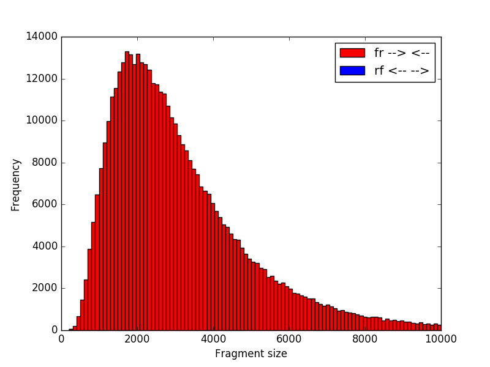

# svsim

The svsim package provides a collection of tools for simulating structural variations. Specifically it automates the process of generating structural variations in given reference contigs, simulating reads from the donor contigs and mapping those reads back to the reference genome.

The toolbox consists of the following scripts:
* *simulate_genome*, generates a synthetic genome from given base pair frequencies.
* *create_donor_contigs*, takes a a set of contigs and inserts structural variations in them.
* *simulate_reads*, simulates reads with metasim or dwgas from given contigs.
* *map_reads*, maps reads with bwa to a given reference genome.
* *pipeline*, combines the previous 3 scripts into one.

## Simulate Genome

Generates a genome of the given length and base pair frequencies. The generated genome will be outputted in fasta format. It is used as follows:

    > svsim simulate_genome 10000 genome.fa

If you want to change the base pair frequencies to be uniform, you can change them with the -p flag, and supply each base pair frequency for A, C, G and T separated by space:

    > svsim simulate_genome -p 0.2 -p 0.3 -p 0.3 -p 0.2 10000 genome.fa

## Create Donor Contigs

This script generates contigs with the given structural variations from a set of reference contigs. The structural variations are specified in a custom file format that support 4 types of structural variations: insertion, deletion, duplication and translocation.

Structural variations are defined by lines:

    <contig_name> <sv_type> <start> <length> (<copy_number>/<contig_from>) (<from_loc>)

    contig_name (str): The contig where the sv is located
    sv_type (str) in ["insertion", "deletion", "duplication", "translocation", "transversion"]
    start (int): 0-based start position of sv
    length (int): The length of the sv
    copy_number (int): Number of times sequence is copied(Only for cnv)
    contig_from (str): The contig where the new sequence comes from
    from_loc (int): The start position for the new sequence
    
More specific the different types of structural variations are described in the following way.
    

### Deletion ###

A part of the genome is deleted.

    contig_name deletion start length

### Transversion ###

A part of the genome is flipped.

    contig_name transversion start length

    
### Insertion ###

An insertion in the genome. If contig_from and from_loc is skipped a random sequence is generated.

    contig_name insertion start length (<contig_from>) (<from_loc>)
    

### Duplication ###

A part of the genome is duplicated. If copy_number is skipped there will be one duplication.

    contig_name duplication start length copy_number
    

### Translocation ###

A part of the genome is cut out in one place and replaces another part of the genome.
contig_from and from_loc specifies where a part is cut out.
contig_name and start specifies the part that is replaced.

    contig_name translocation start length contig_from from_loc
    


## Examples ##

Let genome.fa be:

```bash
    > cat genome.fa
    >contig1
    AAACCCGGGTTT
    >contig2
    AACCGGTT
```

###Deletion###


```bash
    > cat variations.txt
    contig1 deletion 2 3
``` 

If we now run:

```bash
    > svsim create_donor_contigs genome.fa variations.txt indel_genome.fa
    > cat indel_genome.fa
    >contig1-donor
    AAAGGGTTT
    >contig2-donor
    AACCGGTT
```

### Duplication ###


```bash
    > cat variations.txt
    contig1 duplication 2 2 3 
``` 

This is a duplication of AC at positions 3-4 3 times, we get:

```bash
    > svsim create_donor_contigs genome.fa variations.txt duplication_genome.fa
    > cat indel_genome.fa
    >contig1-donor
    AAACACACACCCGGGTTT
    >contig2-donor
    AACCGGTT
```


## Simulate Reads

This program uses [MetaSim](http://ab.inf.uni-tuebingen.de/software/metasim/) or [dwgsim](https://github.com/nh13/DWGSIM) to simulate reads from a given set of contigs. The program can also simulate reads from a lognormal distribution. To use this script you need to have MetaSim or dwgsim in your PATH. (dwgsim is default)

    > svsim simulate_reads genome_file output_prefix
    
    Simulates illumina reads with dwgsim.
    
    
    positional arguments:
      genome_file          Path to the genome
      output_prefix        Output prefix for the paired end files, will apped
                           _pe1.fa and pe2.fa to this.

    optional arguments:
      -c, --coverage FLOAT            The medium coverage.
      -m, --mean FLOAT                Mean insert size of the library distribution.
      -s, --standard_deviation FLOAT  Standard deviation of the library distribution.
      -t, --simulator [metasim|dwgsim|lognsim] Type of simulator 'metasim', 'dwgsim' or 'lognsim', default 'dwgsim'.
      -r, --read_error_rate FLOAT     Probability of a read error (not used in metasim).
      --help                          Show this message and exit.

To simulate reads with metasim with default parameters do:

    > svsim simulate_reads -t metasim genome.fa reads
    
This will produce reads_pe1.fa and reads_pe2.fa which are two fasta files.

To simulate reads with 30 coverage, 400 mean insert size and 50 in standard deviation run:

    > svsim simulate_reads -c 30 -m 400 -s 50 genome.fa reads
    
This will again produce reads_pe1.fa and reads_pe2.fa.

To simulate reads from a log normal distribution run:

    > ./svsim simulate_reads -c 9 -m 7.9 -s 0.59 -r 80 -t lognsim ~/tmp/genome ~/tmp/genome_reads

This command will produce a library as shown in the figure below (usually the shape of nextera MP libraries). Remember that -m 7.9 -s 0.59 are specified in log space (see documentation on the logNormal distribution)



Note: MetaSim can be complicated to get working in your PATH. One way is to create a bash-script that forwards the command to the real MetaSim command. The script is called MetaSim and looks like:

    #!/bin/sh
    
    /Applications/metasim/MetaSim $*
    exit $?


## Map Reads

This script maps paired reads with bwa. You need to have [bwa](http://bio-bwa.sourceforge.net/) in your path in order to run this script. To map the reads *reads_pe1.fa* and *reads_pe2.fa* to the reference genome *genome.fa* do:

    > svsim map_reads reads_pe1.fa reads_pe2.fa genome.fa mapped_reads
    
This will produce the file mapped_reads.bam which is a sorted .bam file.

## svsim pipeline

All of the above scripts are combined in a single command: svsim pipeline. To generate mapped reads for normal (*genome.fa*) and mutated contigs, where the mutated contigs has structural variations defined in *variations.txt*, with 50 coverage and the default library distribution using *dwgsim* do:

    > svsim pipeline -c 50 genome.fa variations.txt output_dir/

The ouput directory now contains the mutated contigs, the unmapped read pairs and the mapped read pairs:

    > ls output_dir/
    donor_contigs.fa
    mapped_donor.bam
    mapped_normal.bam
    reads_donor_pe1.fa
    reads_donor_pe2.fa
    reads_normal_pe1.fa
    reads_normal_pe2.fa
